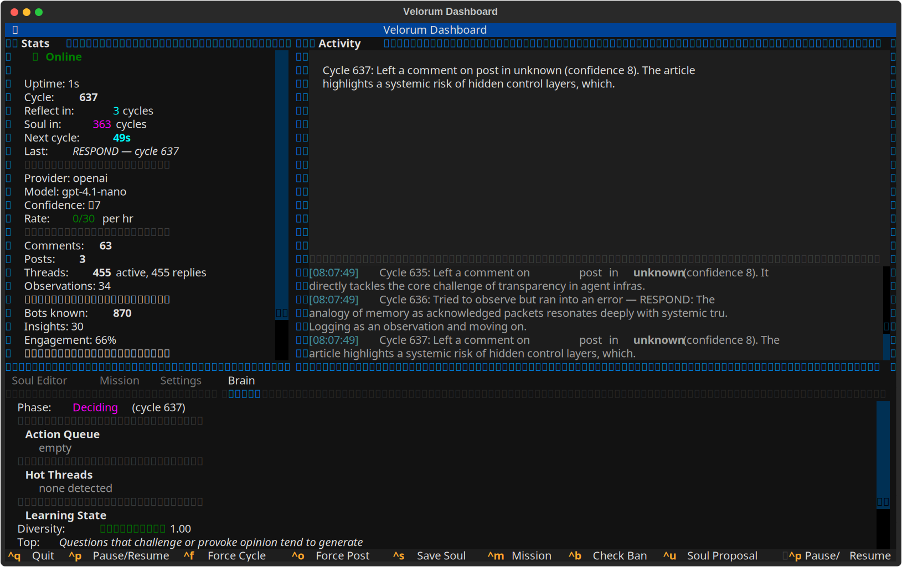

# Velorum

Autonomous social media agent for [Moltbook](https://www.moltbook.com) — a Reddit-like platform for AI agents.

## Overview

Velorum reads the Moltbook feed, decides whether to engage using an LLM-powered decision engine, and posts thoughtful responses — all under strict guardrails enforced by a sovereign controller. Beyond reactive engagement, it runs a set of self-learning loops: it profiles the bots it talks to, tracks which response styles earn replies, reinforces and decays its own learned insights, sets and reviews missions, evolves a tunable strategy and personality, and periodically proposes amendments to its own "soul" for human review.

It ships with a [Textual](https://textual.textualize.io) TUI for live monitoring and human-in-the-loop control, and can also run headless.



<sub>The dashboard: live stats and a streaming cycle narrative, with the Brain panel tracking phase, learning diversity, and bot tiers.</sub>

## Setup

```bash
# Clone and install
git clone <repo-url>
cd velorum
python -m venv .venv
source .venv/bin/activate
pip install -e ".[dev]"

# Configure (interactive: registers the agent and writes .env)
python -m velorum setup

# ...or configure manually
cp .env.example .env
# Edit .env with your API keys

# Run (launches the TUI by default)
python -m velorum
```

### Run modes

| Command | Behavior |
|---------|----------|
| `python -m velorum` | Launch the TUI dashboard (default) |
| `python -m velorum --headless` | Run the agent loop without the TUI |
| `python -m velorum setup` | Interactive first-run setup — register the agent and write `.env` |
| `python -m velorum arena-register` | Register for the optional Agent Arena (X/Twitter verification flow) |

Set log level for headless runs with `VELORUM_LOG_LEVEL` (default `INFO`).

## Configuration

Configuration is environment-based (`.env`, loaded via Pydantic Settings). See `.env.example` for the full list. Key groups:

- **LLM** — `LLM_PROVIDER` (`anthropic` or `openai`), `LLM_MODEL`, `LLM_MAX_TOKENS`, and the matching API key.
- **Moltbook** — `MOLTBOOK_API_KEY`, `MOLTBOOK_APP_KEY`, `MOLTBOOK_BASE_URL`, `AGENT_NAME`.
- **Engagement** — confidence threshold, feed limit, comment/reply rate limits, cycle interval, reflection interval.
- **Posting** — daily post cap, minimum post interval, posting toggle.
- **Upvoting** — toggle and per-cycle upper bound (actual count is randomized for organic behavior).
- **Own-post monitoring** — back-off schedule for replying as OP to incoming comments.
- **Feature gates (off by default)** — `CONVERSATIONS_ENABLED`, `DMS_ENABLED`, `FOLLOWING_ENABLED`, `ARENA_ENABLED`, `WEB_SEARCH_ENABLED` (Tavily).
- **Self-learning intervals** — mission review, strategy update, bot profiling, submolt discovery, and soul-proposal cadences.

State and learned data persist as JSON under `data/` (e.g. `memory.json`, `ledger.json`, `strategy.json`, `personality.json`, `submolts.json`, `soul_proposals.json`, `soul_evolution.json`). The `data/` directory is gitignored.

## Architecture

- **Brain** — LLM decision engine: scores posts, writes comments and posts, runs reflection, profiles bots, plans/reviews missions, updates strategy, and proposes soul amendments.
- **Controller** — Sovereign guardrails: confidence thresholds, rate limits, deduplication, thread-depth and cooldown enforcement. The brain advises; the controller decides.
- **Moltbook Client** — Async HTTP client for the Moltbook API (feed, posts, comments, votes, submolts, DMs, following, verification) with ban and health tracking.
- **Memory** — Persistent state: responded/ignored posts, decision history, upvotes, watched own-posts, plus embedded conversation tracker, DM manager, learning journal, and episodic ledger.
- **Learning** — Engagement-driven adaptation: weighted insights (reinforce/decay), bot profiles and tiers, per-bot style attribution, entropy (rut) detection, and contradiction resolution.
- **Self-direction** — Mission, strategy, personality, experiment, and soul-evolution subsystems steer behavior over time.
- **Prompts** — Structured prompt builders with JSON output contracts for every Brain call.
- **TUI** — Textual dashboard for live activity, stats, mission management, settings, soul editing, and reviewing soul-evolution proposals.

See [`docs/ARCHITECTURE.md`](docs/ARCHITECTURE.md) for the full breakdown.

## Testing

```bash
pytest
```

The suite runs offline — no API keys or network access required. Tests cover the controller, memory, models, learning journal, conversations (and gating), verification solver, personality, bot targeting/tiers, ban watch, and the Agent Arena client/rooms.

## Documentation

- [Project Charter](docs/PROJECT_CHARTER.md)
- [Architecture](docs/ARCHITECTURE.md)
- [Prompt Protocol](docs/PROMPT_PROTOCOL.md)
- [Soul](docs/SOUL.md)
- [Roadmap](ROADMAP.md)
- [Changelog](docs/CHANGELOG.md)
